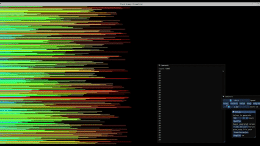

  # 🔁 Push_swap  
  **"Because Swap_push doesn’t feel as natural." — developed by [@ifrankerem](https://github.com/ifrankerem)**  

  Push_swap is a sorting algorithm project written in **C**, part of the **42 curriculum**.  
  The goal is to sort a stack of integers using a **limited set of stack operations**, with the smallest possible number of moves.  

  It’s a challenging mix of **algorithm design**, **complexity analysis**, and **low-level optimization**, testing both your problem-solving and C programming skills.

  ---

  ## 🧩 Overview

  You are given two stacks — `a` and `b`.  
  - Stack **a** initially contains a random sequence of integers (positive or negative).  
  - Stack **b** is empty.  
  - Your task is to **sort stack a** in ascending order using a predefined set of operations.

  You can only use the following operations:

  | Operation | Description |
  |------------|-------------|
  | `sa` | Swap the top two elements of stack a |
  | `sb` | Swap the top two elements of stack b |
  | `ss` | Perform `sa` and `sb` simultaneously |
  | `pa` | Push the top element of b onto a |
  | `pb` | Push the top element of a onto b |
  | `ra` | Rotate a upward (first element becomes last) |
  | `rb` | Rotate b upward (first element becomes last) |
  | `rr` | Perform `ra` and `rb` simultaneously |
  | `rra` | Reverse rotate a (last element becomes first) |
  | `rrb` | Reverse rotate b (last element becomes first) |
  | `rrr` | Perform `rra` and `rrb` simultaneously |

  ---

  ## ⚙️ How It Works

  The **push_swap** program:
  - Takes a list of integers as arguments  
  - Calculates the **shortest possible sequence** of operations to sort them  
  - Prints the sequence to standard output  

  Example:
  ```bash
  ./push_swap 2 1 3 6 5 8
  sa
  pb
  pb
  pb
  sa
  pa
  pa
  pa
  ```

  Error handling:
  ```bash
  ./push_swap 0 one 2 3
  Error
  ```

  ---

  ## 🚀 Running the Project

  ### 1️⃣ Clone the repository
  ```bash
  git clone https://github.com/ifrankerem/push_swap.git
  cd push_swap
  ```

  ### 2️⃣ Build
  ```bash
  make
  ```

  ### 3️⃣ Run
  ```bash
  ./push_swap <numbers>
  ```

  Example:
  ```bash
  ./push_swap 4 67 3 87 23
  ```

  You can test your output using the **checker** program:
  ```bash
  ARG="4 67 3 87 23"
  ./push_swap $ARG | ./checker_OS $ARG
  # Output → OK or KO
  ```

  ---

  ## 📈 Benchmarks

  To get a perfect score:
  - ✅ Sort **100 numbers** in fewer than **700 operations**  
  - ✅ Sort **500 numbers** in fewer than **5500 operations**

  Minimum passing thresholds (≈80%):
  - 100 numbers < 1100 ops  
  - 500 numbers < 8500 ops  

  The project is graded based on the **efficiency** and **accuracy** of your sorting algorithm.

  ---

  ## 🧠 Algorithmic Approach

  To achieve optimal results, this project requires balancing between algorithmic complexity and move count.  
  Common strategies used:
  - **Index mapping** (normalization of input values)
  - **Radix sort** for large datasets (non-comparison-based)
  - **Insertion or selection sort** for smaller stacks
  - **Recursive partitioning** of stack values
  - **Adaptive rotation patterns** to minimize moves

  The challenge is to find the **sweet spot** between simplicity and efficiency — especially for mid-sized datasets where Radix and chunk-based methods overlap.

  ---

  ## 💬 Example Output

  ```
  0 sa
  1 pb
  2 pb
  3 sa
  4 pa
  5 pa
  ```

  Each operation is printed in sequence, separated by newlines.
  ---

  ## 🔴 YouTube Video
  Here are walkthrough and demo videos explaining the project structure, algorithm, and runtime behavior.

  ▶️ **Project Overview:**
  [https://www.youtube.com/watch?v=rY4tZnFEBo8](https://www.youtube.com/watch?v=rY4tZnFEBo8)
  
  ---

  ## 🧮 Example Visualization

  

  *(Visualization: Sorting steps represented as swaps and rotations)*

  ---

  ## 💡 Key Takeaways

  - Deep understanding of **stack operations** and **data manipulation**
  - Hands-on with **time complexity** and **optimization**
  - Practical use of **C memory management** (`malloc`, `free`)
  - Ensuring **no memory leaks** or undefined behavior
  - Clean modular design following **Norminette** standards

  ---

  ## 📜 License

  This project was developed as part of the **42 School curriculum**.  
  It is meant for **educational and portfolio purposes** only.  
  Please do not reuse it for submission or grading.

  ---

  🧑‍💻 *Developed with precision and care by [@ifrankerem](https://github.com/ifrankerem)*
